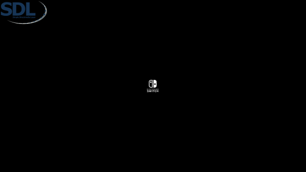

# Mini SDL Demo

featuring SDL2 + SDL2_mixer + SDL2_image
on Nintendo Switch using libnx

## Building

You need SDL2, SDL2_image with png support, SDL2_mixer with ogg support.

### Switch:

Get devkitA64 + the `switch-sdl2_mixer` and `switch-sdl2_image` portlibs.

    make

### Linux:

    ./make_linux

## Running

### Switch:

Use `nx-hbmenu`.

### Linux:

    ./sdl_demo

## Controls

### Switch (Controller):

- UP/DOWN: rendering speed
- B: show drawing trail
- Minus: close

### Linux (Keyboard):

- UP/DOWN: rendering speed
- B: show drawing trail
- Escape: close

## Screenshot

## License

(c) 2018 carstene1ns, provided under ISC license, see [LICENSE.md](LICENSE.md) for details.
